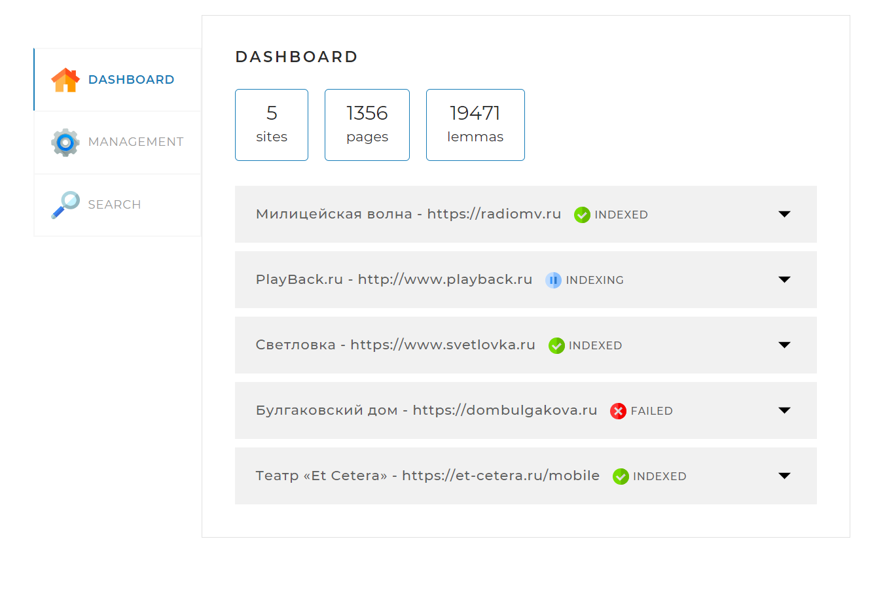
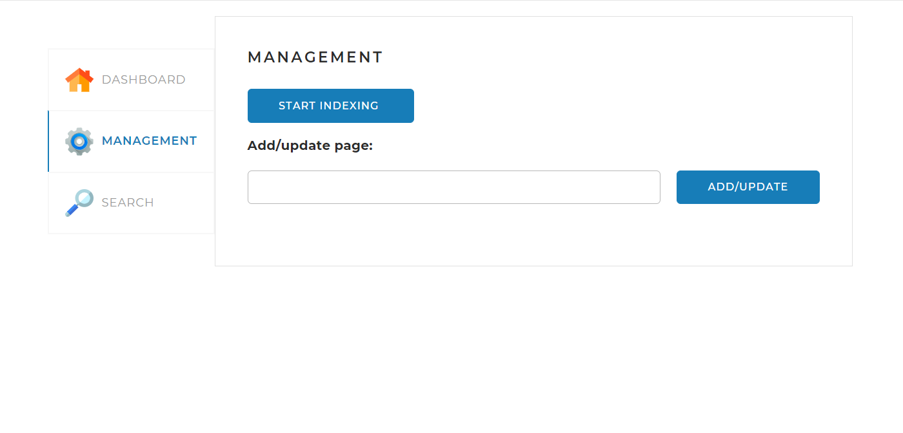
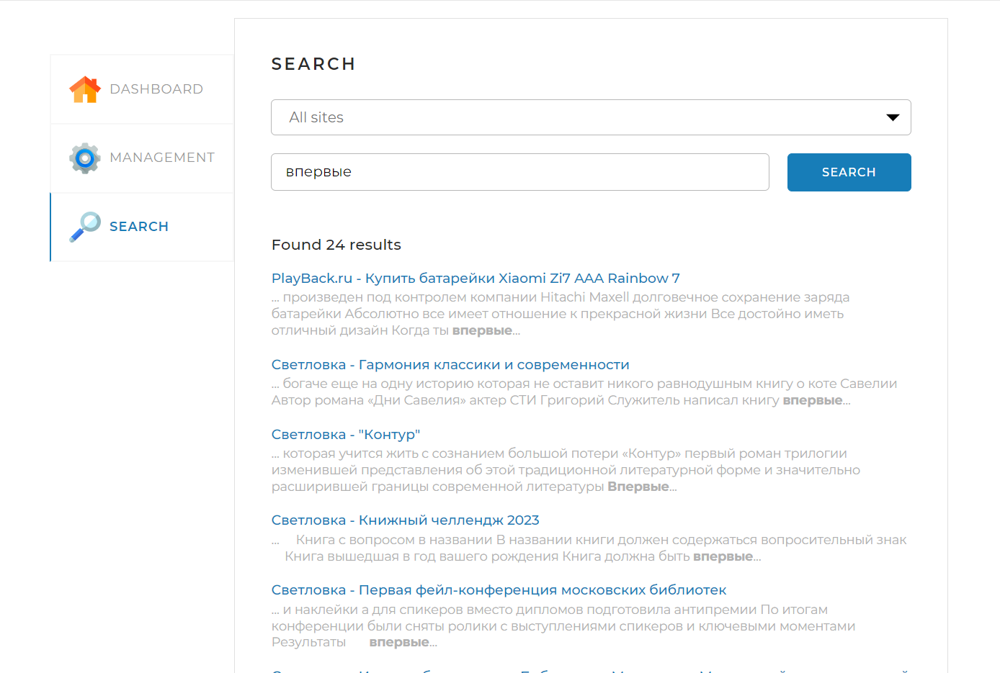

# Описание проекта Searchengine
Данный проект реализует поисковый движок.
Поисковый движок должен представлять из себя Spring-приложение
(JAR-файл, запускаемый на любом сервере или компьютере), работающее с
локально установленной базой данных MySQL, имеющее простой
веб-интерфейс и API, через который им можно управлять и получать
результаты поисковой выдачи по запросу.
Пользователю предоставляется специальный
API со следующими основными функциями: 
<li>индексирование сайтов;</li>
<li>выдача основных сведений по сайтам;</li>
<li>поиск ключевых слов в проиндексированных сайтах и предоставление их пользователю.</li>

## Стэк используемых технологий
JAVA, Maven, Spring Framework, JPA, JSOUP, SQL, Morphology Library Lucene

## Веб-страница

В проект также входит веб-страница, которая позволяет управлять процессами, реализованными
в движке.

Страница содержит три вкладки.

### Вкладка DASHBOARD

Эта вкладка открывается по умолчанию. На ней
отображается общая статистика по всем проиндексированным сайтам, а также
детальная статистика и статус по каждому из сайтов (статистика,
получаемая по запросу <i>/statistics</i>).

### Вкладка MANAGEMENT

На этой вкладке находятся инструменты управления 
поисковым движком — запуск (запрос <i>/startIndexing</i>) 
и остановка (запрос <i>/stopIndexing</i>) полной индексации
(переиндексации), а также возможность добавить (обновить)
отдельную страницу по ссылке (запрос <i>/indexPage/{pagePath}</i>).

### Вкладка SEARCH

Эта вкладка предназначена для тестирования поискового
движка. На ней находится поле поиска и выпадающий список с
выбором сайта, по которому искать, а при нажатии на кнопку
<i>SEARCH</i> выводятся результаты поиска (по запросу /search).

## Файл настройки
<i>application.yaml</i>

## Для запуска проекта необходимо:
<li>установить MySQL Server и создать на нем БД search_engine;</li>
<li>установить актуальный username (имя пользователя) и password (пароль) в файле application.yaml;</li>
<li>скомпилировать проект в IDE с помощью класса Application;</li>
<li>для доступа к управлению движком перейдите по адресу http://localhost:8080/ в вашем браузере.</li>

